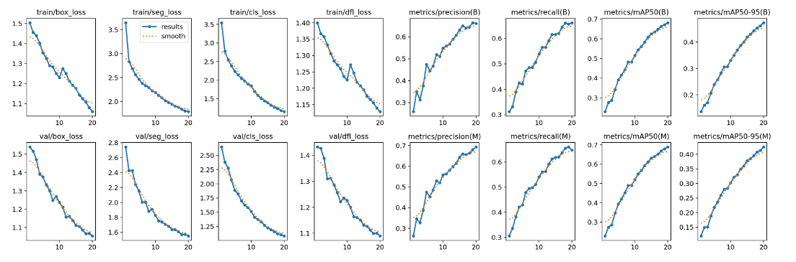
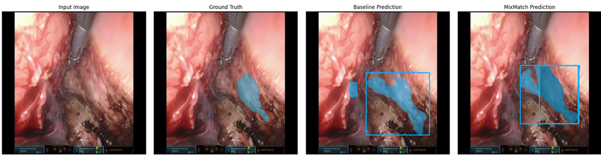
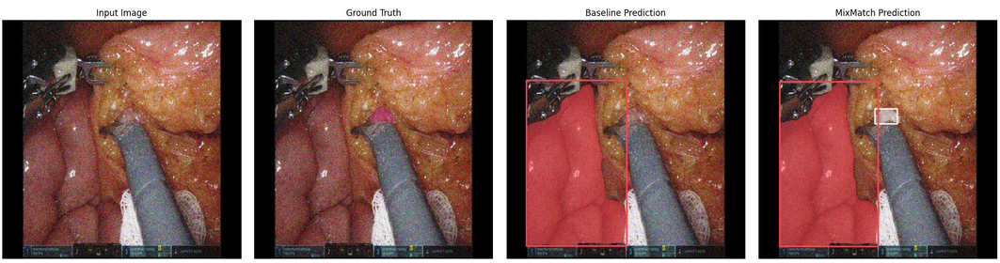
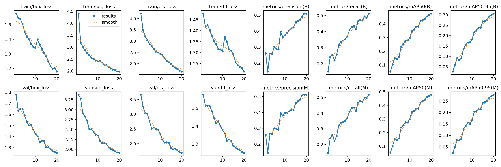
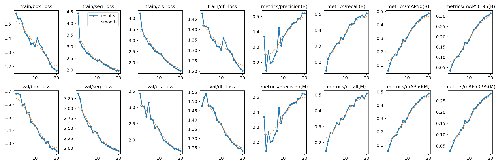
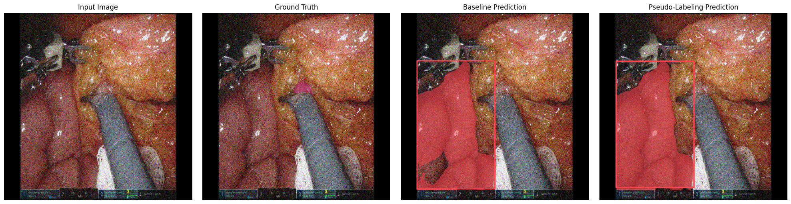

# 🧠 Semi-Supervised Learning for Medical Image Segmentation

<div align="center">


</div>

---

## 📊 Performance Summary

<div align="center">

| Model | 🎯 mAP@0.5 | 📈 mAP@0.5:0.95 | 🚀 Improvement |
|------|-----------|----------------|---------------|
| **Baseline YOLOv12** | 0.4865 | 0.3149 | - |
| **FixMatch SSL** | 0.5809 | 0.3773 | +19.4% |
| **MixMatch SSL** | **0.6816** | **0.4726** | **+40.1%** |

⚡ **MixMatch achieves the highest performance with a 40.1% improvement over the baseline**

</div>

---

## 📸 Visual Results

### 🔬 MixMatch (Best Performer)

<div align="center">

**Training Curves**  


| | |
|:-:|:-:|
|  |  |
| Sample 1 | Sample 2 |

</div>

---

### 🏫 Mean Teacher

<div align="center">

**Training Curves**  


| | |
|:-:|:-:|
|  |  |
| Sample 1 | Sample 2 |

</div>

---

### 🏷️ Pseudo-Labeling

<div align="center">

**Training Curves**  


| | |
|:-:|:-:|
|  |  |
| Sample 1 | Sample 2 |

</div>

---

## 🚀 Quick Start

```bash
# Clone repository
git clone https://github.com/ahsitab/semi-supervised-medical-segmentation.git
cd semi-supervised-medical-segmentation

# Create virtual environment
python -m venv venv
source venv/bin/activate   # Windows: venv\Scripts\activate

# Install dependencies
pip install -r requirements.txt
````

---

## 📦 Requirements

```txt
torch>=2.0.0
torchvision>=0.15.0
ultralytics>=8.0.0
opencv-python>=4.8.0
numpy>=1.24.0
scikit-learn>=1.3.0
matplotlib>=3.7.0
pandas>=2.0.0
```

---

## 🏥 Dataset

### Dresden Surgical Anatomy Dataset

A high-quality dataset for **semantic segmentation in laparoscopic surgery**.

**Details**

* 32 real surgical procedures
* Resolution: 1920 × 1080
* 11 anatomical structures
* ≥1,000 images per class
* Pixel-wise expert annotations

**Structures**

* Colon, Liver, Pancreas, Small Intestine
* Spleen, Stomach, Ureter, Vesicular Glands
* Abdominal Wall
* Inferior Mesenteric Artery, Intestinal Veins

---

## 🧪 Implemented Methods

| Method              | Status | Performance     | Notebook                                          |
| ------------------- | ------ | --------------- | ------------------------------------------------- |
| **MixMatch**        | ✅ Best | 🥇 +40.1%       | `semi-supervised-learning-mixmatch.ipynb`         |
| **Mean Teacher**    | ✅      | 📊 Strong       | `semi-supervised-segmentation-mean-teacher.ipynb` |
| **Pseudo-Labeling** | ✅      | 📈 Baseline SSL | `semi-supervised-learning-pseudo-labeling.ipynb`  |

---

## 📁 Project Structure

```txt
semi-supervised-medical-segmentation/
├── notebooks/
├── models/
├── plots/
├── data/
├── src/
├── requirements.txt
└── README.md
```

---

## 🛠️ Usage

### Training

```python
from src.training import train_ssl_model

config = {
    "method": "mixmatch",
    "labeled_ratio": 0.2,
    "epochs": 100,
    "batch_size": 16,
    "alpha": 0.75,
    "T": 0.5
}

model = train_ssl_model(config)
```

---

### Evaluation

```python
from src.evaluation import evaluate_model

results = evaluate_model(
    model_path="models/mixmatch_ssl.pt",
    test_data="data/test/"
)

print("mAP@0.5:", results["map_50"])
print("mAP@0.5:0.95:", results["map_50_95"])
```

---

## 🔬 Experimental Insights

* MixMatch consistently outperforms other SSL techniques
* Consistency regularization + entropy minimization is key
* SSL is highly effective with limited labeled medical data

---

## 📈 Preprocessing Pipeline

1. Intensity normalization (CLAHE, gamma correction)
2. Noise reduction (Gaussian & median filtering)
3. Data augmentation (geometric + photometric + elastic)

---

## 🔗 Resources

* Dresden Dataset: [https://www.surgical-ai.com/datasets](https://www.surgical-ai.com/datasets)
* YOLOv12: [https://github.com/ultralytics/ultralytics](https://github.com/ultralytics/ultralytics)
* Kaggle Notebooks:

  * Pseudo-Labeling
  * Mean Teacher
  * MixMatch

---

## 👤 Contributor

**Asfar Hossain Sitab**
Project Lead & Researcher

---

## 📄 License

MIT License

---

<div align="center">

⭐ **If you find this project useful, please give it a star!**

</div>
```

---

If you want, I can also:

* ✨ Shorten this for **conference submission**
* 📘 Rewrite for **thesis / capstone report**
* 🧪 Add **ablation study section**
* 🧑‍🏫 Prepare **viva questions & answers** from this README
